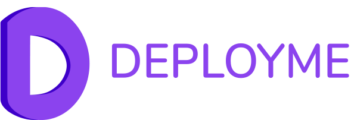
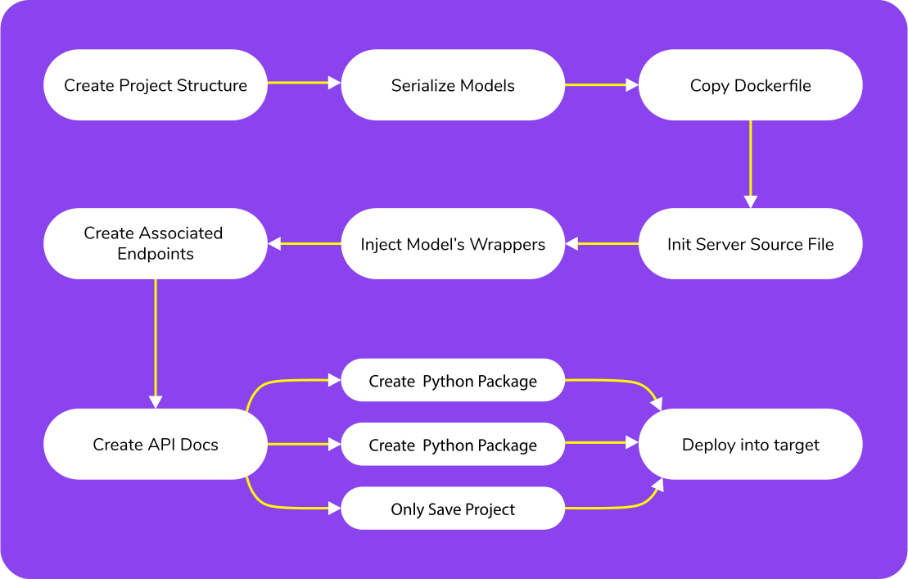

# DeployMe

<p align="center">
    
</p>

<div align="center">


[](https://deployme.readthedocs.io/en/latest/)
</div>


If you have been working on ML models, then you have probably faced the task of deploying these models.
Perhaps you are participating in a hackathon or want to show your work to management.

According to our survey, more than `60%` of the data-scientists surveyed faced this task and more than `60%` of the respondents spent more than half an hour creating such a service.

The most common solution is to wrap it in some kind of web framework (like Flask).

Our team believes that it can be made even easier!

Our tool automatically collects all the necessary files and dependencies, creates a docker container, and launches it! And all this in one line of source code.

# Pipeline


<p align="center">
    
</p>


1. First, we initialize the project directory for the next steps;
2. Next, we serialize your machine learning models (for example, with Joblib or Pickle);
3. Next, we create a final `.py` file based on the templates that contains the endpoint handlers. Handlers are chosen based on models, and templates based on your preferences (templates are also `.py` files using, for example, Sanic or Flask);
4. Copy or additionally generate the necessary files (e.g. Dockerfile);
5. The next step is to compile the API documentation for your project;
6. After these steps, we build a Docker container, or a Python package, or we just leave the final directory and then we can deploy your project in Kubernetes, or in Heroku.


## Prerequisites

On your PC with local run you must have Docker & Python >= 3.8

## Installation

Install `deployme` with pip:

```bash
pip install deployme
```

or with your favorite package manager.

## Example

```python
from sklearn.datasets import load_iris
from sklearn.ensemble import RandomForestClassifier

from deployme import cook

X, y = load_iris(return_X_y=True, as_frame=True)

clf = RandomForestClassifier()
clf.fit(X, y)

cook(strategy="docker", model=clf, port=5010)
```

After running script you can see new Docker container.
To interact with service simply open URL, logged after script running.

On this page you can see Swagger UI, test simple requests (examples included).
For direct post-requests you can use Curl:

```bash
curl -X POST "http://127.0.0.1:5001/predict" -H  "accept: application/json" -H  "Content-Type: application/json" -d "{\"data\":[{\"sepal length (cm)\":5.8,\"sepal width (cm)\":2.7,\"petal length (cm)\":3.9,\"petal width (cm)\":1.2}]}"
```

## Models support

Currently, we support the following models:

- `sklearn`
- `xgboost`
- `catboost`
- `lightgbm`

## RoadMap

1. Deploy to Heroku & clusters
2. Model's basic vizualization
3. Tighter integration with [LightAutoML](https://github.com/sb-ai-lab/LightAutoML)
4. Support many popular ML-frameworks, such as `XGBoost`, `TensorFlow`, `CatBoost`, etc.
5. *Your ideas!*

## Contribution

We are always open to your contributions!
Please check our issue's and make PR.
